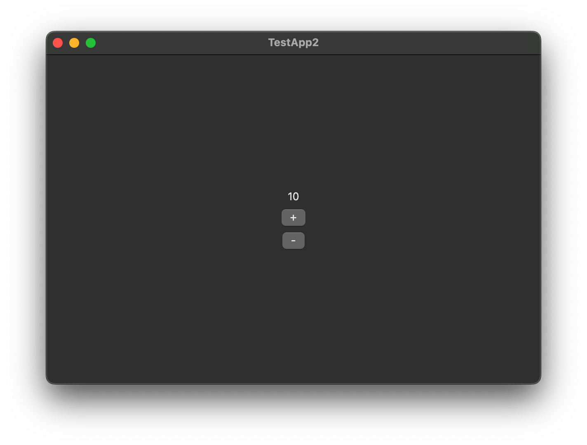

After [creating a new Poly project](/guides/creating-project),
let's create a counter app as a gentle introduction to Poly.
In this guide, we will use [TypeScript](https://www.typescriptlang.org) to create the app, using the `@poly-gui/core` and `@poly-gui/widgets` TypeScript libraries.

## The Main File

Before writing any code, let's have a look at the main file `src/main.ts`.
When building the binary of the portable layer, this main file is fed into the compiler.
Then, the compiler produces a single binary that is spawned by the native layer when running the app,
which runs the `main` function defined in the main file. Now, let's go through the `main` function.

### The Context Object

The first point of interest is the following snippet

```ts
const context = createApplication({
  messageChannel: new StdioMessageChannel(),
});
```

The `createApplication` function, exported by `poly`, creates a context object that stores all the runtime information of the application,
such as created views and registered callbacks.
Pass this `context` to any Poly API that asks for a context object.

An instance of `StdioMessageChannel` is used as the channel between the portable layer and the native layer for exchanging messages.

:::danger
Poly only supports running the portable layer with Node.JS at the moment!
:::

### The Application Instance

After creating the context object, it is used to start the application:

```ts
const instance = runApplication(context);
```

The `runApplication` function, also exported by `poly`,
returns a `Promise` that will awaited at the end of the `main` function to keep the application alive.

### Application Logic

In between awaiting the instance and the call to `runApplication` is where the application logic resides,
such as drawing the UI and creating windows.
In this case of creating the counter app, this is where the UI of the counter and the logic of the counter sits.

By default, the `main` function creates an empty window that has the application name as its title:

```ts
await createWindow(
  {
    title: "Counter",
    description: "A counter app written in TypeScript.",
    width: 600,
    height: 400,
    tag: "main",
  },
  context,
);
```

The `tag` is a handle to the window.
It is useful, for example, when specifying where to display the created widgets, which we will get into later on this page.
**It must be unique amongst all the windows created by the application.**

### Keeping the Application Alive

Finally, this line:

```ts
await instance
```

keeps the application run loop alive.

## Making the Counter UI



The counter UI consists of three elements: the current count, the increment button, and the decrement button, all inside a column in order.

Let's define a class called `CounterScreen` that encapsulates the UI code and the logic of manipulating and keeping track of the count. Create a new file called `counter-screen.ts` next to `main.ts`:

```ts
// src/counter-screen.ts
import { type ApplicationContext } from "poly/application"
import { type Widget, WidgetController } from "@poly-gui/widgets"

class CounterScreen extends WidgetController {
  constructor(context: ApplicationContext) {
    super(context)
  }
}

export { CounterScreen }
```

`CounterScreen` subclasses `WidgetController`, which is an abstract class that defines the interface
for a class that controls and holds references to widgets.
In this case, `CounterScreen` will hold a reference to the counter text label because we will need it to update its content.

### Defining the UI tree

`@poly-gui/widgets` exports a variety of widgets that can be composed together to form the UI.
Let's first create a `Text` to display the current count.

```ts ins={4-5, 9, 11, 16-17}
// src/counter-screen.ts
import { type ApplicationContext } from "poly/application"
import {
  type Widget,
  Text,
} from "@poly-gui/widgets"

class CounterScreen extends WidgetController {
  private count = 0

  private readonly countText: Text;

  constructor(context: ApplicationContext) {
    super(context)

    this.countText = new Text(context)
    this.countText.content = `${this.count}`
  }
}

export { counterScreen }
```

Here, we are creating a new instance of `Text` and settings its initial content to the initial count (`this.count`) which is 0.
We are also storing a reference to the `Text` under `this.countText` so that we can use it later when we need to update it.

:::note
`countText` is made `readonly` to prevent accidental re-assignment of it, but the `Text` that `countText` references can still be modified.
[Read more about the `readonly` modifier.](https://www.typescriptlang.org/docs/handbook/2/classes.html#readonly)
:::

Let's create the increment and the decrement buttons, as well as defining the callbacks when they are clicked:

```ts ins={6, 21-23, 25-27, 30-32, 34-36}
// src/counter-screen.ts
import { type ApplicationContext } from "poly/application"
import {
  type Widget,
  type PolyWidget,
  Text,
  Button,
} from "@poly-gui/widgets"

class CounterScreen extends WidgetController {
  private count = 0

  private readonly countText: Text;
  constructor(context: ApplicationContext) {
    super(context)

    this.countText = new Text(context)
    this.countText.content = `${this.count}`

    const incBtn = new Button(context);
    incBtn.label = "+";
    incBtn.onClick = this.incrementCounter.bind(this);

    const decBtn = new Button(context);
    decBtn.label = "-";
    decBtn.onClick = this.decrementCounter.bind(this);
  }

  private incrementCounter() {

  }

  private decrementCounter() {

  }
}

export { counterScreen }
```

We want to put the count text and the buttons in a column, so we are going to use the `Column` widget:

```ts ins={30-33}
// src/counter-screen.ts
import { type ApplicationContext } from "poly/application"
import {
  type Widget,
  type PolyWidget,
  Text,
  Button,
  Column,
} from "@poly-gui/widgets"

class CounterScreen extends WidgetController {
  private count = 0

  private readonly countText: Text

  constructor(context: ApplicationContext) {
    super(context)

    this.countText = new Text(context)
    this.countText.content = `${this.count}`

    const incBtn = new Button(context)
    incBtn.label = "+"
    incBtn.onClick = this.incrementCounter.bind(this)

    const decBtn = new Button(context)
    decBtn.label = "-"
    decBtn.onClick = this.decrementCounter.bind(this)

    const col = new Column(context);
    // Center-align the children along the horizontal axis of the column
    col.horizontalAlignment = Alignment.CENTER;
    col.addChildren(this.countText, incBtn, decBtn);
  }

  private incrementCounter() {

  }

  private decrementCounter() {

  }
}

export { counterScreen }
```

To center everything in the window, we are going to wrap the column with a `Center` widget:

```ts ins={35-36}
// src/counter-screen.ts
import { type ApplicationContext } from "poly/application"
import {
  type Widget,
  type PolyWidget,
  Text,
  Button,
  Column,
} from "@poly-gui/widgets"

class CounterScreen extends WidgetController {
  private count = 0

  private readonly countText: Text

  constructor(context: ApplicationContext) {
    super(context)

    this.countText = new Text(context)
    this.countText.content = `${this.count}`

    const incBtn = new Button(context)
    incBtn.label = "+"
    incBtn.onClick = this.incrementCounter.bind(this)

    const decBtn = new Button(context)
    decBtn.label = "-"
    decBtn.onClick = this.decrementCounter.bind(this)

    const col = new Column(context);
    // Center-align the children along the horizontal axis of the column
    col.horizontalAlignment = Alignment.CENTER;
    col.addChildren(this.countText, incBtn, decBtn);

    const center = new Center(context);
    center.child = col;
  }

  private incrementCounter() {

  }

  private decrementCounter() {

  }
}

export { counterScreen }
```

We need to let Poly know the root view of our screen (which is a `WidgetController`),
so we also need to implement the `widget(): PolyWidget` method from `WidgetController`.

```ts ins={15, 38, 41-43}
// src/counter-screen.ts
import { type ApplicationContext } from "poly/application"
import {
  type Widget,
  type PolyWidget,
  Text,
  Button,
  Column,
} from "@poly-gui/widgets"

class CounterScreen extends WidgetController {
  private count = 0

  private readonly countText: Text
  private readonly rootView: PolyWidget

  constructor(context: ApplicationContext) {
    super(context)

    this.countText = new Text(context)
    this.countText.content = `${this.count}`

    const incBtn = new Button(context)
    incBtn.label = "+"
    incBtn.onClick = this.incrementCounter.bind(this)

    const decBtn = new Button(context)
    decBtn.label = "-"
    decBtn.onClick = this.decrementCounter.bind(this)

    const col = new Column(context)
    // Center-align the children along the horizontal axis of the column
    col.horizontalAlignment = Alignment.CENTER
    col.addChildren(this.countText, incBtn, decBtn)

    const center = new Center(context)
    center.child = col
    this.rootView = center
  }

  public override widget(): PolyWidget {
    return this.rootView
  }

  private incrementCounter() {

  }

  private decrementCounter() {

  }
}

export { counterScreen }
```

### Modifying the Counter

When the increment button is clicked, the counter needs to be incremented and the count text updated. We can do that in the `incrementCounter` method:

```ts
class CounterScreen extends WidgetController {
  // ...
  private incrementCounter() {
    this.count += 1
    this.countText.update(() => {
      this.countText.content = `${this.count}`
    })
  }
  // ...
}
```

Same for the decrement button:

```ts
class CounterScreen extends WidgetController {
  // ...
  private decrementCounter() {
    this.count -= 1
    this.countText.update(() => {
      this.countText.content = `${this.count}`
    })
  }
  // ...
}
```

When updating any widget in Poly, the `update` method needs to be called.
It accepts a callback in which updates on the widget should be done.
The `update` method lets Poly know that the widget is updated and needs to be redrawn.

Now, when the increment button is clicked, `incrementCounter` is called, which increases the `count` variable by one and updates the counter text with the new count.
When the decrement button is clicked, `decrementCounter` is called, which decreases the `count` variable by one and updates the counter text accordingly.

### Showing the Counter Screen

Now that we have created the counter screen, let's import it in the main file and display it:

```ts ins={5,27-28}
// src/main.ts
import { createApplication, runApplication } from "poly/application";
import { StdioMessageChannel } from "poly/bridge";
import { createWindow } from "poly/window";
import { CounterScreen } from "./counter-screen.js";

async function main() {
  const context = createApplication({
    messageChannel: new StdioMessageChannel(),
  });

  const instance = runApplication(context);

  createWindow(
    {
      title: "TestApp2",
      description: "A Poly application written in TypeScript.",
      width: 600,
      height: 400,
      tag: "main",
    },
    context,
  );

  const screen = new CounterScreen(context);
  // obtain the root widget of the screen and show it in the "main" window
  screen.widget().show({ window: "main" })

  await instance;
}

main()
```

## Running the Application

We have finished creating the counter! Before running the application, we need to compile the TypeScript code first:

```shell
pnpm run build
```

This generates a binary named `bundle` in `<project-name>/build`:

```diff
MyNewApp/
├── gtk/
│   ├── packaging/
│   │   ├── rpm/
│   │   │   └── app.spec
│   │   └── launch.sh
│   ├── src/
│   │   └── main.cxx
│   └── CMakeLists.txt
├── macOS/
│   ├── MyNewApp/
│   │   ├── AppDelegate.swift
│   │   └── main.swift
│   ├── MyNewApp.xcodeproj
│   └── project.yml
+├── build/
+│   └── bundle
└── app/
    ├── src/
    │   └── main.ts
    ├── package.json
    └── tsconfig.json
```

Now, open the `.xcodeproj` file in the `macOS` folder in XCode. Wait for XCode to finish building the project, then hit the Run button.

That's it! You have successfully created your first Poly application with TypeScript.
